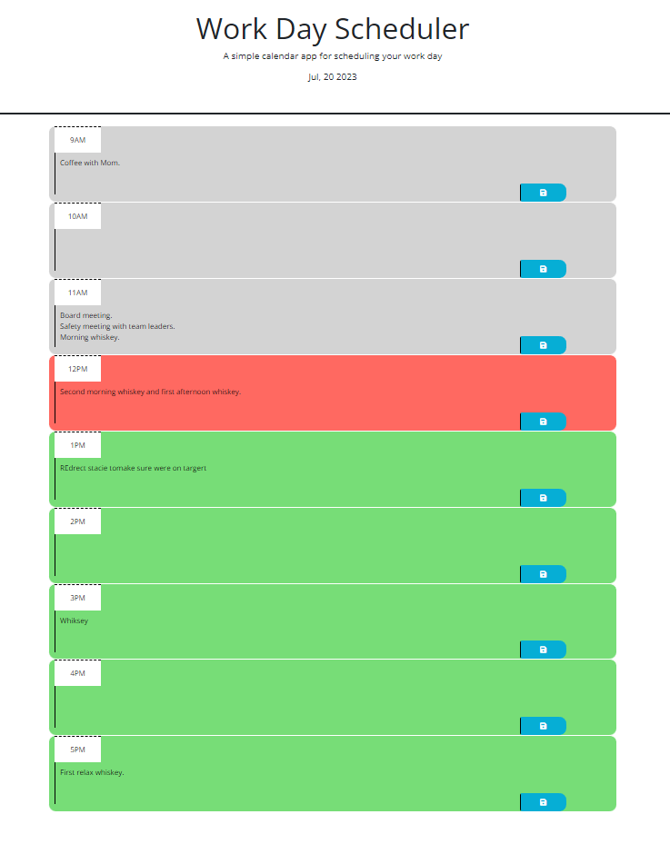
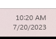
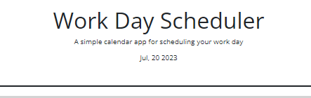

# Interactive Work Day Scheduler

This is a very straightforward work day scheduler - no month or year planner, simply one day at a time.

First, the day, month and year are displayed right at the top.

As the user's work day grows busier and busier, here they have somewhere to log and track it all. 

By entering an event in the respective timeslot and clicking the 'save' icon, the user can save that event in place.

As the day progresses, the style changes. 

If it's an hour that has yet to come, the timeslot becomes green. 

If it's in the current hour, the timeslot becomes red.

Otherwise, all past timeslots turn grey.

